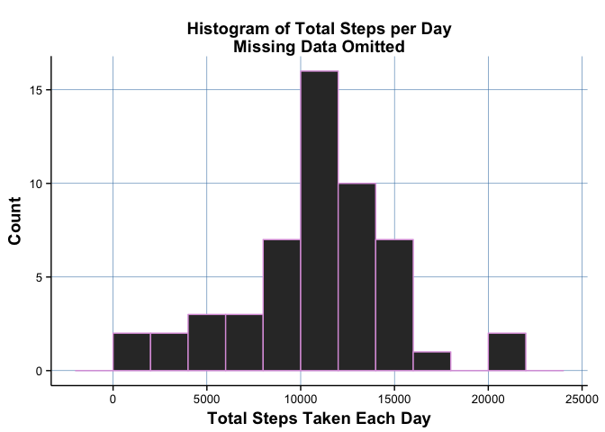
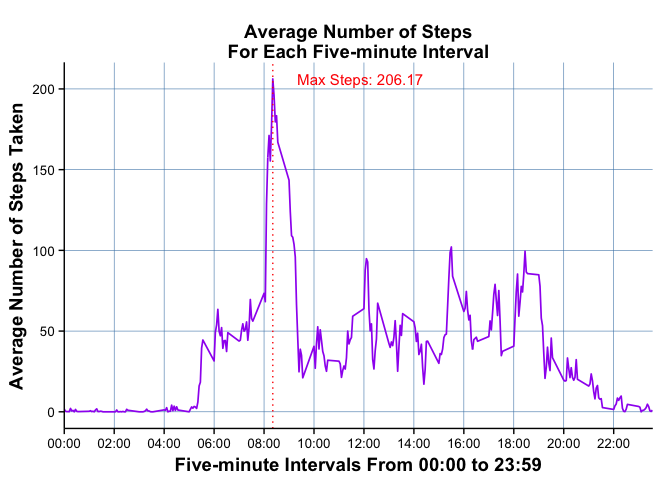
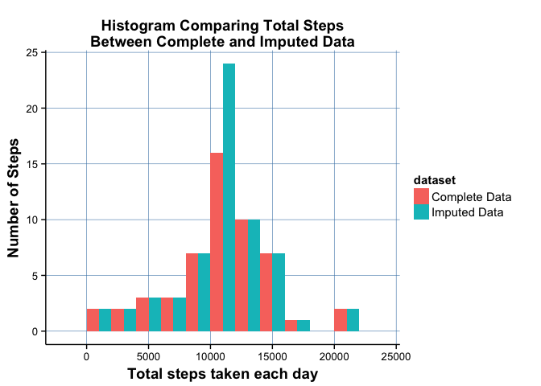
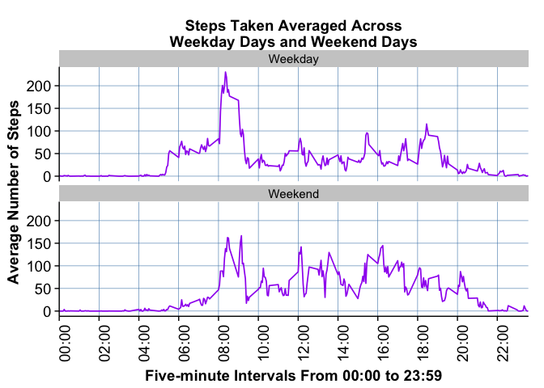

Reproducible Research: Peer Assessment 1
==========================================
Created by Bob Fridley on 2015-07-09 21:15:03

>
Environment | Value
----------- | ------------------
R Version   | R version 3.2.0 (2015-04-16)
OS          | x86_64-apple-darwin13.4.0

***

### Initialize Environment
>
* Cleanup environment data/variables

```r
rm(list=ls())
```
>
* Save default value for displaying scientific notation

```r
scipenSave <- getOption("scipen")
```
>
* Turn off scientific notation for numbers in plots

```r
options("scipen" = 1, digits = 2)
```
>
* Seed for reproductibility

```r
set.seed(351900)
```
>
* Set directory/file paths

```r
baseDir <- getwd()
dataDir <- file.path(baseDir, "data")
figureDir <- file.path(baseDir, "figures")
fileZip <- file.path(dataDir, "activity.zip")
fileCsv <- file.path(dataDir, "activity.csv")
```
>
* Downloaded file info

```r
fileInfo <- file.path(dataDir, "data-file-downloaded.txt")
```
>
* Data file url

```r
dataUrl <- "https://d396qusza40orc.cloudfront.net/repdata/data/activity.zip"
```
>
* Required R packages for project

```r
packages <- c("ggplot2", "cowplot", "xtable", "knitr")
```
>
* Create directory for figures

```r
if (!file.exists(figureDir)) {
        dir.create(figureDir)
}
```
>
* Function to load packages     

```r
#' Simplified loading and installing of packages
#'
#' @param p - Character vector of required packages
loadPackages <- function(p) {
        # Check that all packages are installed
        if (length(setdiff(p, rownames(installed.packages()))) > 0) {
                install.packages(setdiff(p, rownames(installed.packages())))  
        }

        # Load packages
        loadp <- suppressWarnings(sapply(p, library, character.only = TRUE, 
                warn.conflicts = TRUE, logical.return = TRUE, 
                verbose = TRUE))

        # Verify that all packages loaded, else stop program execution
        if (!all(loadp)) {
                notloaded <- which(loadp == FALSE)

                # Display the packages that could not be loaded
                cat("Unable to load the following packages:")
                for(i in notloaded) {
                        cat("\r\n", packages[i])
                }
                
                # Stop execution of program
                stop("Stopping Execution", call. = FALSE)
        }
}
```
>
* Function to download csv file

```r
#' Simplified data file download
#'
#' @param dir     Data file directory
#' @param zip     Downloaded data zip file
#' @param info    File containing last metrics from download
#' @param url     Url of file to download
#' @param csv     Name of unzipped data file
#' @param refresh TRUE = explicit download of file
#'                FALSE = do not download
#'                   If file does not exist, file is downloaded
#'                   Use metrics from previously downloaded file
downloadZipFile <- function(dir, zip, info, url, csv, refresh) {
        # Create data directory is not exists
        if (!file.exists(dir)) {
                dir.create(dir)
        }
        
        # Download data file if not exists
        # or if download info file not exists
        # or if refresh download is TRUE
        if (!file.exists(zip) || !file.exists(info) || refresh == TRUE) {
                download.file(url, destfile = zip,
                        method = "curl", mode = "wb")
                # Save download time and write to file
                dtDownload <- format(Sys.time(), "%Y-%m-%d %H:%M:%S")
                cat(dtDownload, file = info)
        } else {
                # Data file exists.  Get download time from saved file
                dtDownload <- scan(file = info, what = "character",
                        sep = "\n")
        }
        
        # Uzip downloaded data file if not exists
        if (!file.exists(csv)) {
                unzip(zip, exdir = dir)
        }

        return(list(fileSize = as.character(file.size(csv)), fileDate = dtDownload, 
                fileUrl = URLdecode(url)))
}
```
>
* Load required packages

```r
loadPackages(packages)
```

```
## 
## Attaching package: 'cowplot'
## 
## The following object is masked from 'package:ggplot2':
## 
##     ggsave
```
>
* Set global options for markdown
    + `opts_chunk` dependent on knitr package

```r
opts_chunk$set(echo = TRUE, results = "hold")
```

***

### Loading and preprocessing the data
>
* Get source data file

```r
f <- downloadZipFile(dataDir, fileZip, fileInfo, dataUrl, fileCsv, TRUE)
```
>
Source File Attribute | Value
--------------------- | ------------------
Size                  | 350829 Bytes
Download Date         | 2015-07-09 21:15:05
URL                   | https://d396qusza40orc.cloudfront.net/repdata/data/activity.zip

>
* Read csv data file
    + The csv file was previously identified as having column headers

```r
act.data <- read.csv(fileCsv, colClasses = c("integer", "character",
        "integer"), na.strings = "NA", header = TRUE)
```
>
* Change `date` from character string to date type 

```r
act.data$date <- as.Date(as.character(act.data$date), format = "%Y-%m-%d")
```
>
* Get subset of `act.data` complete cases

```r
act.data.complete <- act.data[complete.cases(act.data), ]
```

***

### What is `mean` total number of steps taken per day
>
* Build data frame of total number of steps per day

```r
act.data.complete.sum <- aggregate(steps ~ date, 
        data = act.data.complete, FUN = "sum")
act.data.complete.sum$month <- as.character(format(act.data.complete.sum$date, "%B"))
unique_months <- unique(act.data.complete.sum$month)
act.data.complete.sum$month <- factor(act.data.complete.sum$month, 
        levels = unique_months)
```
>
* Make a histogram of the total number of steps taken each day

```r
plot.1 <- ggplot(act.data.complete.sum, aes(steps)) + 
        geom_histogram(binwidth = 2000, colour = "plum") + 
        labs(title = "Histogram of Total Steps per Day\nMissing Data Omitted", 
                x = "Total Steps Taken Each Day", 
                y = "Count") + 
        background_grid(major = "xy", minor = "none", colour.major = "steelblue") + 
        theme(axis.text.x = element_text(size = 10), 
                axis.text.y = element_text(size = 10))

save_plot(file.path(figureDir, "hist-steps-day-complete.jpg"), plot.1, base_aspect_ratio = 1.5)

print(plot.1)
```

 

>
* Calculate the `mean` and `median` total steps per day (missing values excluded)

```r
act.complete.mean.value <- mean(act.data.complete.sum$steps)
act.complete.median.value <- median(act.data.complete.sum$steps)
```

>
Mean   | Median
------ | ------
10766.19 | 10765

***

### What is the average daily activity pattern?
>
* Build data frame of average number of steps per day

```r
act.data.complete.mean <- aggregate(act.data.complete$steps, 
        list(interval = as.numeric(as.character(act.data.complete$interval))), 
        FUN = "mean")
```
>
* Rename column `x` to `steps.mean`

```r
names(act.data.complete.mean)[2] <- "steps.mean"
```
>
* Calculate maximum 5-minute interval and `vline` for `ggplot`

```r
max.steps.index <- which.max(act.data.complete.mean$steps.mean)
max.xtick <- act.data.complete.mean$interval[max.steps.index]
max.steps <- act.data.complete.mean$steps.mean[max.steps.index]
```
>
* Prepare breaks and labels for time series plot

```r
tsBreaks <- seq(0, 2400, by = 200)
tsLabels <- formatC(tsBreaks, width = 4, flag = "0")
tsLabels <- paste0(substr(tsLabels, 1, 2), ":", substr(tsLabels, 3, 4))
```
>
* Time series plot of the 5-minute interval and average number of steps taken

```r
plot.2 <- ggplot(act.data.complete.mean, aes(interval, steps.mean)) + 
        geom_line(color = "purple", size = 0.6) + 
        labs(title = "Average Number of Steps\nFor Each Five-minute Interval", 
                x = "Five-minute Intervals From 00:00 to 23:59", 
                y = "Average Number of Steps Taken") + 
        scale_x_discrete(breaks = tsBreaks, labels = tsLabels) + 
        background_grid(major = "xy", minor = "none", colour.major = "steelblue") + 
        theme(axis.text.x = element_text(size = 10), 
                axis.text.y = element_text(size = 10)) + 
        geom_vline(aes(xintercept = max.xtick), colour = "red", linetype = "dotted") + 
        annotate("text", x = max.xtick + 350, y = max.steps, size = 4, 
                label = paste0("Max Steps: ", 
                formatC(max.steps, digits = 5)), colour = "red")

save_plot(file.path(figureDir, "time-series-avg-steps.jpg"), plot.2, base_aspect_ratio = 1.5)

print(plot.2)
```

 

#### Which 5-minute interval, on average across all the days in the dataset, contains the maximum number of steps?
>
Max 5-minute Interval | Index | Mean
----- | --------------------- | ----
0835 | 104 | 206.17

***

### Imputing missing values
>
* Identify/count missing values

```r
missing.rows <- is.na(act.data$steps)
missing.values <- sum(missing.rows)
missing.total <- length(missing.rows)
```
>
Rows with Missing Values | Total Missing Values
------------------------ | --------------------
17568 | 2304

>
* Copy original (raw) dataset to create imputed dataset

```r
act.imputed <- act.data
```
>
* Devise strategy for filling in all missing values in dataset
    + Replace `NA` values with the interval average

```r
rep.times <- length(act.data$steps) / length(act.data.complete.mean$steps.mean)
act.imputed[missing.rows, "steps"] <- rep(act.data.complete.mean$steps.mean, 
        times = rep.times)[missing.rows]
```
>
* Build data frame of total number of steps per day

```r
act.imputed.sum <- aggregate(steps ~ date, data = act.imputed, FUN = "sum")
```
>
* Build data frame from original dataset with `month` column

```r
act.original.sum <- act.data.complete.sum[, 1:2]
```
>
* Calculate the `mean` and `median` total steps per day of the imputed data

```r
act.imputed.mean.value <- mean(act.imputed.sum$steps)
act.imputed.median.value <- median(act.imputed.sum$steps)
```

>
Mean | Median
---- | ------
10766.19 | 10766.19

>
* Calculate difference of `mean`, `median` between complete data and imputed data

>
Mean | Median
---- | ------
0 | 1.19

>
* Add column `dataset` to identify original and imputed data

```r
act.imputed.sum$dataset <- "Imputed Data"
act.original.sum$dataset <- "Complete Data"
```
>
* Merge imputed data with complete data

```r
act.all <- rbind(act.original.sum, act.imputed.sum)
```
>
* Histogram comparing complete/imputed total number of steps taken each day

```r
plot.3 <- ggplot(act.all, aes(steps, fill = dataset)) + 
        geom_histogram(binwidth = 2000, position = "dodge") + 
        labs(title = "Histogram Comparing Total Steps\nBetween Complete and Imputed Data", 
                x = "Total steps taken each day", 
                y = "Number of Steps") + 
        background_grid(major = "xy", minor = "none", colour.major = "steelblue") + 
        theme(axis.text.x = element_text(size = 10), 
                axis.text.y = element_text(size = 10))

save_plot(file.path(figureDir, "hist-months-steps-day-complete.jpg"), plot.3, base_aspect_ratio = 1.3)

print(plot.3)
```

 

#### What is the impact of imputing missing data on the estimates of the total daily number of steps?
>
* As the histogram above shows, the total number of steps increased after imputing the data.
* The `mean` did not change and `median` shows a very slight change after imputing the data.

***

### Are there differences in activity patterns between weekdays and weekends?
>
* Add `daytype` (weekday or weekend) to dataset as factor column

```r
dayname <- weekdays(act.imputed$date)
weekend <- c("Saturday", "Sunday")
act.imputed$daytype <- factor(dayname %in% weekend, labels=c("Weekday", "Weekend"))

print(head(act.imputed))
print(levels(act.imputed$daytype))
print(table(act.imputed$daytype))

act.imputed.mean <- aggregate(act.imputed$steps, 
        list(interval=as.numeric(as.character(act.imputed$interval)), 
        weekdays=act.imputed$daytype), 
        FUN="mean")
```

```
##   steps       date interval daytype
## 1 1.717 2012-10-01        0 Weekday
## 2 0.340 2012-10-01        5 Weekday
## 3 0.132 2012-10-01       10 Weekday
## 4 0.151 2012-10-01       15 Weekday
## 5 0.075 2012-10-01       20 Weekday
## 6 2.094 2012-10-01       25 Weekday
## [1] "Weekday" "Weekend"
## 
## Weekday Weekend 
##   12960    4608
```
>
* Rename column `x` to `steps.mean`

```r
names(act.imputed.mean)[3] <- "steps.mean"
```
>
* Create time-series panel plot

```r
plot.4 <- ggplot(act.imputed.mean, aes(interval, steps.mean)) + 
        geom_line(color="purple", size=0.6) + 
        facet_wrap(~ weekdays, nrow=2) + 
        labs(title="Steps Taken Averaged Across\nWeekday Days and Weekend Days", 
                x="Five-minute Intervals From 00:00 to 23:59", 
                y="Average Number of Steps") + 
        background_grid(major="xy", 
                minor="none", 
                colour.major="steelblue") + 
        scale_x_discrete(breaks=tsBreaks, labels=tsLabels) + 
        theme(axis.text.x=element_text(angle=90))

save_plot(file.path(figureDir, "panel-plot-time-series.jpg"), plot.4, base_aspect_ratio = 1.3)

print(plot.4)
```

 

>
* As the panel plot above shows:
    + There is more activity during 8 AM hour of the **Weekdays**.
    + There are consistently higher levels of activity during the afternoon hours of the **Weekends**.

***

>
* Restore defaults

```r
options("scipen" = scipenSave)
```
